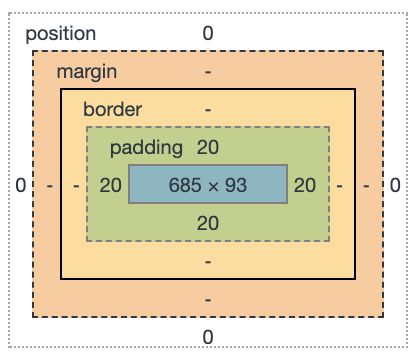

# CSS Basics

<section>

## The Cascade

* cascades from top to bottom of a style sheet
* the specificity of the selectors breaks the cascade
* Every selector in CSS has a **specificity weight**

| selector      | specificity weight    |
|:-------------:|:---------------------:|
| type          |  `0-0-1`              |
| class         |  `0-1-0`              |
| ID            |  `1-0-0`              |

Therefore, the ID selector will take precedence regardless of where it appears in the cascade, e.g. `<div id="circle"></div>` will be red:
```css
#circle {
    background: red;
}

div {
    background: green;
}
```

### Hack the Cascade

```css
ul {
    list-style: circle !important;
}
```

### Unset
Change all properties to the parent value if inheritable or the initial value if not
```css
all: unset;
```


</section>

---

<section>

## Comments

```css
/* this is a comment in CSS */
```

</section>

---

<section>

## Vendor prefixes

* Mozilla Firefox: `-moz-`
* Opera: `-o-`
* Microsoft Internet Explorer: `-ms-`
* Webkit (Google Chrome and Apple Safari): `-webkit-`

They still provide support for some of the older browsers that leveraged them. Use them if you wish to support older browsers.

</section>

---

<section>

## CSS Variables

Define base values for variables in `:root`
```css
:root {
  --bg-colour: #C5C6C7;
  --text-colour: #1A1B1C;
}
```

Overwrite variables for specific contexts
```css
.dark {
  --bg-colour: #1A1B1C;
  --text-colour: #C5C6C7;
}
```

Use variables as property values
```css
section {
  background-color: var(--bg-colour);
  color: var(--text-colour);
}
```

### Manipulate CSS Variables from JavaScript
CSS
```css
.flashlight {
  --cursorX: 0px;
  --cursorY: 0px;

  top: var(--cursorX);
  left: var(--cursorY);
}
```

JavaScript
```js
let flashlight = document.querySelector('.flashlight');
flashlight.style.setProperty("--cursorX", e.offsetX + "px");
flashlight.style.setProperty("--cursorY", e.offsetY + "px");
```

</section>

---

<section>

## Selectors

```css
selector {
    property: value;
}
```

| Selector               |        CSS                      |
|:------------------:|:----------------------------:|
| Type                   |     `div`                      |
| Class                   |     `.class`                     |
| ID                   |    `#id`                      |
| Descendant           |    `.ancestor .descendant`    |
| Direct Child           |    `.parent > .child`        |
| General Sibling       |    `.element ~ .sibling`       |
| Adjacent Sibling    |    `.element + .sibling`    |
| Attribute Present    |    `[href]`                |
| Attribute Equals    |    `[href="value"]`        |
| Attribute Contains    |    `[href*="value"]`        |
| Attribute Begin        |    `[href^="value"]`        |
| Attribute End        |    `[href$="value"]`        |
| Attribute Spaced    |    `[href~="value"]`        |
| Attribute Hyphenated|    `[href|="value"]`        |


### Type selector
identifies an element based on its type, i.e. HTML tag

```css
div { /* ... */ }
```

### Class selector
allow to apply the same styles to different elements at once by using the same `class` attribute value across _multiple elements_

```css
.class { /* ... */ }
```

_GOOD PRACTISE_: value that refers to the content of an element


### ID selector
target only one unique element per page at a time (not good practise)

```css
#id { /* ... */ }
```


### Child Selectors

#### Descendant Selector
*`<a>` element must reside within a `<div>` with the `class` attribute value _parent-class_
* matches every element that follows an identified ancestor
* descendant element _does not have to come directly after_ the ancestor element inside the document tree

<figure>

```css
div.parent-class a {
    /* ... */
}
```

```html
<div class="parent-class">
    <p>
        <a href="#"></a> <!-- selected -->
    </p>
    <a href="#"></a> <!-- selected -->
</div>
```

</figure>

#### Direct Child Selector
only identify elements that fall directly within some other element

<figure>

```css
.parent-class > a {
    /* ... */
}
```

```html
<div class="parent-class">
    <p>
        <a href="#"></a> <!-- not selected -->
    </p>
    <a href="#"></a> <!-- selected -->
</div>
```

</figure>


### Sibling Selectors

#### General Sibling Selector
* elements that share a _common parent_
* element is only selected if it comes _after_ the specified element

<figure>

```css
.element ~ .sibling {
    /* ... */
}
```

```html
<div class="parent">
    <div class="sibling"></div> <!-- not selected -->
    <div class="element"></div>
    <div class="sibling"></div> <!-- selected -->
    <div class="sibling"></div> <!-- selected -->
</div>
```

</figure>


#### Adjacent Sibling Selector
* elements that share a _common parent_
* only select sibling elements _directly following_ after another sibling element

<figure>

```css
.element + .sibling {
    /* ... */
}
```

```html
<div class="parent">
    <div class="sibling"></div> <!-- not selected -->
    <div class="element"></div>
    <div class="sibling"></div> <!-- selected -->
    <div class="sibling"></div> <!-- not selected -->
</div>
```

</figure>


### Attribute Selectors


* **Attribute Present Selector**: element includes an attribute or not

<figure>

```css
a[target] {
    /* ... */
}
.links[id] {
    /* ... */
}
[class] {
    /* ... */
}
```

```html
<a href="">Link 1</a> <!-- not selected -->
<a href="" target="_blank">Link 1</a> <!-- selected -->

<nav class="links" id="nav"></nav> <!-- selected -->
<aside class="links"></aside> <!-- not selected -->

<div></div> <!-- not selected -->
<a class="button" href="#"></a> <!-- selected -->
```

</figure>


* **Attribute Equals Selector**: element includes an attribute and desired matching value

```css
a[href="https://markusdoppler.at"] {
    /* ... */
}
```


* **Attribute Contains Selector**: part of an attribute value

```css
a[href*="markusdoppler"] { /* ... */ }
```


* **Attribute Begin Selector**: attribute value should _begin_ with the stated value

```css
a[href^="https://"] { /* ... */ }
```


* **Attribute End Selector**: attribute value should _end_ with the stated value

```css
a[href$=".pdf"] { /* ... */ }
```


* **Attribute Spaced Selector**: attribute value that should be whitespace-separated, with _one word matching_ the exact stated value

```css
a[rel~="tag"] { /* ... */ }
```


* **Attribute Hyphenated Selector**: attribute value may be hyphen-separated however the hyphen-separated words must _begin_ with the stated value

```css
a[lang|="en"] { /* ... */ }
```


### Pseudo-Classes

#### Link Pseudo-classes
link specific (define if a link has or hasn’t been visited)

```css
a:link {
    /* ... */
}
a:visited {
    /* ... */
}
```

#### User Action Pseudo-classes
when a user moves their cursor over the element

```css
a:hover {
    /* ... */
}
```

when a user engages an element, such as clicking on an element

```css
a:active {
    /* ... */
}
```

when a user has made an element the focus point of the page, often by using the keyboard to tab from one element to another

```css
a:focus {
    /* ... */
}
```

**Note**: `a:hover` _must_ come after `a:link` and `a:visited` in the CSS definition in order to be effective.

**Note**: `a:active` _must_ come after `a:hover` in the CSS definition in order to be effective.


#### User Interface State Pseudo-classes
user interface state of elements, particularly within **form elements**

the `:enabled` pseudo-class selects an input that is in the default state of enabled and available for use

the `:disabled` pseudo-class selects an input that has the `disabled` attribute tied to it


```css
input:enabled {
    /* ... */
}
input:disabled {
    /* ... */
}
```

for **checkbox** and **radio button** input elements

`:checked` pseudo-class selects checkboxes or radio buttons that are checked

when a checkbox or radio button has neither been selected nor unselected it lives in an indeterminate state


```css
input:checked {
    /* ... */
}
input:indeterminate {
    /* ... */
}
```

#### Structural & Position Pseudo-classes
selects the first/last/only child element within its parent element

```css
li:first-child a {
    /* ... */
}
li:last-child a {
    /* ... */
}
li:only-child a {
    /* ... */
}
```

will select the first/last/only element of its type within a parent

```css
p:first-of-type {
    /* ... */
}
p:last-of-type {
    /* ... */
}
p:only-of-type {
    /* ... */
}
```

will select the element(s) specified by `n`

```css
p:nth-child(n)
p:nth-last-child(n)
p:nth-of-type(n)
p:nth-last-of-type(n)
```

Examples for `n`:

```css
1
5
3n
2n+1
odd
even
n+2
2n-1
-3n+12
```

* Counting begins at `1`, i.e. `n` must be a positive value
* General syntax is `(a×n)±b`: every `a`'th element starting at `b` (`b` can be negative; if `a` is negative, `b has to be positive`)
* `n+b`: every element starting at the `b`'th

Example:

<figure>

```css
p:nth-child(n+1) {
    /* ... */
}
```

```html
<p></p> <!-- not selected -->
<p></p> <!-- selected -->
<p></p> <!-- selected -->
<p></p> <!-- selected -->
```

</figure>


#### Target Pseudo-class
selects the element whose ID attribute value matches the URI fragment identifier (part after `#` in a URL)

```css
:target { /* ... */ }
```

#### Empty Pseudo-class
selects elements that do not contain children or text nodes

```css
:empty { /* ... */ }
```

#### Negation Pseudo-class
takes an argument which is filtered out from the selection to be made

```css
div:not(.lovely) { /* ... */ }
```


### Pseudo-elements (also `::pseudo-element`)
* only one pseudo-element may be used within a selector at a given time
* first letter/line of text within an element
```css
:first-letter
:first-line
```

#### Generated Content Pseudo-elements
* create new `inline` level pseudo-elements just inside the selected element

```css
:before {
    content: "";
}
:after {
    content: "(" attr(href) ")";
}
```

#### Fragment Pseudo-element
identifies part of the document that has been selected, or highlighted, by a user’s actions

```css
::selection {
    /* ... */
}
::-moz-selection {
    /* ... */
}
```


### Universal selector
* selects all elements
```css
* {
    /* ... */
}
```

* selects _every imaginable_ element
```css
*, *:before, *:after {
    /* ... */
}
```


### Combining selectors

#### general syntax

```css
prequalifiers key-selector {
    /* ... */
}
```

#### combined syntax
only select `<div>` elements with the class _class-name_ (not the best practise though)

```css
div.class-name {
    /* ... */
}
```

select all elements within a parent

```css
.parent > * {
    /* ... */
}
```

#### Selecting several elements
* for elements that share the same style
* apply style to several selectors at one time, seperated with commas `,`

```css
b, emph {
    /* ... */
}
```

</section>

---

<section>

## The Box model



### Properties
* `height`
* `width`
* `padding`
* `border`
* `margin`

### Width & Height
for `block`- and `inline-block`-level elements

```css
width: 100px;
height: 50px;
```


#### min-max width

```css
max-width: 200px;
```

```css
min-width: 900px;
```

The best way to use `min-width` is to define a `width` value as a percentage and use an absolute value for the `min-width` property


### Margin & Padding

_INFO_: `margin` and `padding` properties are completely transparent and do not accept any color values

#### Shorthands
* all four sides
```css
margin: 20px;
```

* `top`+`bottom` & `left`+`right`
```css
margin: 10px 20px;
```


* unique values for all four sides (`top` - `right` - `bottom` - `left`)
```css
margin: 10px 20px 30px 0px;
```


#### Longhands

```css
margin-top: 20px;
margin-right: 20px;
margin-bottom: 20px;
margin-left: 20px;
```

_BEST USAGE_: When we wish to identify only one margin or padding value


#### Margin Center Trick

in order to center a block-level element (with `width` property set) inside its parent element, one can use

```css
margin: 0 auto;
```

#### Margin Overlap Trick

Set a negative margin to make it overlap its parent box (and possibly other content)

```css
margin: -66px 0 22px 0;
```


### Border

#### shorthand

```css
border: 3px solid #fba;
```


#### longhand

`border-width`
[→ CSS Lengths]

`border-style`
* `solid`
* `double`
* `dashed`
* `dotted`

`border-color`
[→ CSS Color]


```css
border-top
border-right
border-bottom
border-left
```

```css
border-top-width
border-top-style
border-top-color
```


### Border Radius
* round all four corners equally
```css
border-radius: 5px;
border-radius: 50%;
```

* round the `top-left`/`bottom-right` and `top-right`/`bottom-left` corners
```css
border-radius: 5px 10px;
```

* round the `top-left`, `top-right`, `bottom-right`, and `bottom-left` corners
```css
border-radius: 5px 10px 15px 20px;
```

*longhand*
```css
border-top-right-radius: 5px;
```


### Box Sizing


```css
*,
*:before,
*:after {
    -webkit-box-sizing: border-box;
        -moz-box-sizing: border-box;
            box-sizing: border-box;
}
```

*possible values*
* `content-box`: default, which means box model is an *additive* design
* `border-box`: any `border` or `padding` property values are included within the `width` and `height` of an element.

</section>