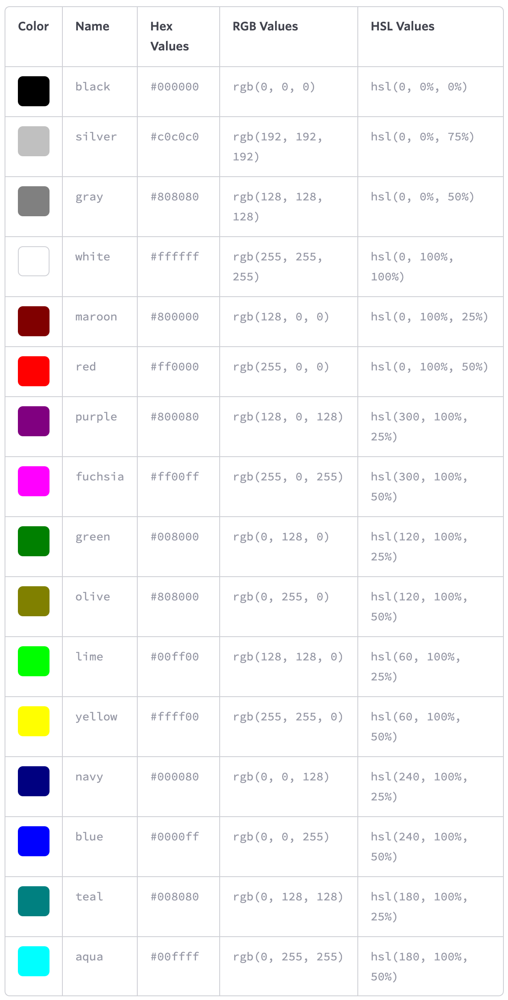

# Styles

<section>

## Colours

### Keywords

* `black`
* `white`
* `blue`
* `red`
* `green`
* `yellow`
* ...

### Hexadecimal notation



* white: `#000000`
* black: `#ffffff`


### RGB(a) values
black: `0`
white: `255`

red - green - blue

```css
rgb(255,255,255)
```

red - green - blue - alpha

```css
rgba(255, 102, 0, .5)
```


### HSL values
|property|value|
|:--------------|:---------------------------------------------------|
|hue            |`0` to `360` (degree of a color on the color wheel)|
|saturation    |`0` to `100%` (`0` being grayscale and `100%` being fully saturated)|
|lightness        |`0` to `100%` (`0` being completely black and `100%` being completely white)|

```css
hsl(60, 100%, 50%)
```



</section>

---

<section>

## Length
* [Mozilla: CSS Length](https://developer.mozilla.org/en-US/docs/Web/CSS/length)


### Absolute lengths

Pixels

```css
10px
```

Points

```css
10pt
```

Inches

```css
1in = 96px
```

### Relative lengths

* Percentages (relative to the parent element)

```css
10%
```

* Em (relative to the element's font-size)

```css
1em
```
The default for em is `16px`.
Once the font-size is set, all other `em`'s are relative to the elements font size!

```css
h1 {
   font-size: 2.5em;        /* 40px/16px - relative to default value */
   line-height: 1.1em;        /* 44px/40px - relative to font-size! */
   margin-bottom: 22px;
}
```

* Rem (relative to the root elements' (i.e. `<html>`) font-size)

```css
1rem
```

By default `1rem` corresponds to `16px`.

* Ch (relative to the width of the `0` character)

```css
7ch
```

</section>

---

<section>

## Typography

### Font-based properties

#### Font-Family

```css
font-family: "Helvetica Neue", Helvetica, Arial, sans-serif;
```

#### Font-Size

```css
font-size: 14px;
```

#### Font-Weight

```css
font-weight: 600;
```

* `100`, `200`, `300`, `400`, `500`, `600`, `700`, `800`, and `900`
* `normal` – `400`
* `bold` – `700`
* `bolder`
* `lighter`
* `inherit`

Attempting to use a weight that’s not available for a given typeface will cause those styles to default to the _closest value_

#### Font-Style

```css
font-style: italic;
```

* `normal`
* `italic`
* `oblique`
* `inherit`

#### Font-Variant

```css
font-variant: small-caps;
```

* `normal`
* `small-caps`
* `inherit`

#### Font

```css
font-stretch: ultra-condensed|extra-condensed|condensed|semi-condensed|normal|semi-expanded|expanded|extra-expanded|ultra-expanded|initial|inherit;
```

#### Line height

```css
line-height: 22px;
line-height: 150%;
line-height: 1.5;
font-size: 15px;
```

the distance between two lines of text (often referred to as _leading_)

*vertically center* a single line of text within an element by setting `line-height` equal to the elements`height` → buttons, alert messages, ...

*BEST PRACTISE*: set to around one and a half times our `font-size` property value

#### Shorthand Font Properties

```css
font: font-style font-variant font-weight font-size/line-height font-family;

font: 14px/24px "Source Code Pro", Inconsolata, "Lucida Console", Terminal, "Courier New", Courier;

font: italic small-caps bold 14px/22px "Helvetica Neue", Helvetica, Arial, sans-serif;
```


### Text-based properties

#### Text align

```css
text-align: center;
```

* `left`
* `right`
* `center`
* `justify`
* `inherit`


#### Text decoration

```css
text-decoration: underline;
text-decoration: underline overline;
```

* `none`
* `underline`
* `overline`
* `line-through`
* `inherit`


#### Text indent
indent the first line of text within an element, as is commonly seen in printed publications

```css
text-indent: 20px;
text-indent: -5px;
```

#### Text shadow

```css
text-shadow: 3px 6px 2px rgba(0, 0, 0, .3);
```

`text-shadow`: `horizontal offset` `vertical offset` `blur radius` `color`


#### Text transform

```css
text-transform: uppercase;
```

* `none`
* `capitalize`
* `uppercase`
* `lowercase`
* `inherit`


#### Letter spacing

```css
letter-spacing: 2px;
letter-spacing: -0.5em;
```

* `none`

#### Word spacing

```css
word-spacing: 20px;
word-spacing: 0.25em;
```

* `none`


#### Text Ellipsis

<figure>
<div>
  <div style="width: 15ch; background: navy; color: white; white-space: nowrap; overflow: hidden; text-overflow: ellipsis;">Lorem ipsum dolor est</div>
</div>

```css
.ellipsis-text {
  overflow: hidden;
  white-space: nowrap;
  text-overflow: ellipsis;
}
```

</figure>

<figure>
<div>
  <div style="width: 15ch; background: navy; color: white; overflow: hidden; display: -webkit-box; -webkit-box-orient: vertical; -webkit-line-clamp: 4;">Lorem ipsum dolor sit amet consectetur, adipisicing elit. Dicta eius quibusdam nobis.</div>
</div>


```css
.ellipsis-box {
  overflow: hidden;
  display: -webkit-box;
  -webkit-box-orient: vertical;
  -webkit-line-clamp: 4;
}
```

</figure>


### Colour

```css
color: #fff;
```


### Websafe Fonts
* Arial
* Courier NewCourier
* Garamond
* Georgia
* Lucida Sans, Lucida Grande, Lucida
* Palatino Linotype
* Tahoma
* Times New Roman, Times
* Trebuchet
* Verdana


### Embedding Web Fonts

```css
@font-face {
    font-family: "Lobster";
    src: local("Lobster"), url("lobster.woff") format("woff");
    font-weight: bold;
    font-style: italic;
    font-variant: small-caps;
    font-stretch: condensed;
}
```

</section>

---

<section>

## Backgrounds

### Shorthand

```css
background: white;
background: #b2b2b2 url("alert.png") 20px 10px no-repeat;
```

### Background Colour

```css
background-color: #b2b2b2;
```

### Background Image

```css
background-image: url("image.png");
```

_default_: repeat horizontally and vertically from the top left of the given element to fill up the element’s background

#### Background Repeat

```css
background-repeat: no-repeat;
```

* `repeat` (_default_)
* `repeat-x`
* `repeat-y`
* `no-repeat`

#### Background Position



```css
background-position: horizontal-offset vertical-offset;
background-position: 20px 10px;
background-position: left top;
background-position: center center;
background-position: 50% 50%;
```

_default_: left top corner of an element
position _relative_ to top left corner
`top`, `right`, `bottom`, `left`, and `center`

**Example**: Background Sprites
```css
span {
     background: url("sprite.png") 0 0 no-repeat;
    height: 16px;
    width: 16px;
}
.second-sprite {
     background-position: -16px 0;
}
.third-sprite {
     background-position: -32px 0;
}
```


#### Background Size (CSS3)

```css
background-size: width height;
background-size: auto 75%;
background-size: cover;
background-size: contain;
```

* `auto`: may be used as either the width or height value to preserve the aspect ratio of the background image
* `cover`: the background image will be resized to completely cover an element’s width and height, the background image’s original aspect ratio will be preserved
* `contain`: the background image will be resized to reside entirely contained within an element’s width and height

#### Background Clip (CSS3)

```css
background-clip: border-box;
```

* `border-box` (default)
* `padding-box`
* `content-box`


### Multiple Backgrounds

The background image value that comes first will be the foremost background image


```css
background: url("foreground.png") 0 0 no-repeat,
            url("middle-ground.png") 0 0 no-repeat,
            url("background.png") 0 0 no-repeat;
```

These shorthand values may also be broken up into comma-separated values across the `background-image`, `background-position`, and `background-repeat` properties.


### Gradients

#### Linear Gradient

<figure class="fig-1-3">

<div style="width: 100%; height: 100%; background: linear-gradient(#648880, #293f50);"></div>

```css
background: #466368;
background: -webkit-linear-gradient(#648880, #293f50);
background:    -moz-linear-gradient(#648880, #293f50);
background:         linear-gradient(#648880, #293f50);
```

</figure>

change the direction:
* `to bottom`: _default_, from the top to the bottom of an element
* `to right`: from the left of an element to the right
* `to right bottom`: from the left top to the right bottom of an element
* `315deg`: gradient to move to the left top of an element
* `135deg`: to the right bottom of an element

[Linear gradient keywords](http://meyerweb.com/eric/thoughts/2012/04/26/lineargradient-keywords/)


#### Radial Gradient

from the inside to the outside of an element

<figure class="fig-1-3">

<div style="width: 100%; height: 100%; background: radial-gradient(#648880, #293f50);"></div>

```css
background: #466368;
background: -webkit-radial-gradient(#648880, #293f50);
background:    -moz-radial-gradient(#648880, #293f50);
background:         radial-gradient(#648880, #293f50);
```

</figure>

<figure class="fig-1-3">

<div style="width: 100%; height: 100%; background: radial-gradient(circle 30px at 40px 40px, rgba(255, 0, 0, 0), rgba(255, 0, 0, 1));"></div>

```css
background: radial-gradient(
  circle 30px at 40px 40px,
  rgba(255, 0, 0, 0),
  rgba(255, 0, 0, 1)
);
```

</figure>


[CSS Gradient Generator](https://www.cssmatic.com/gradient-generator)


#### Colour Stops

<figure class="fig-1-3">

<div style="width: 100%; height: 100%; background: linear-gradient(to right, #f6f1d3, #648880, #293f50);"></div>

```css
background: #648880;
background: linear-gradient(to right, #f6f1d3, #648880, #293f50);
```

</figure>

<figure class="fig-1-3">

<div style="width: 100%; height: 100%; background: linear-gradient(to right, #f6f1d3, #648880 85%, #293f50);"></div>

```css
background: #648880;
background: linear-gradient(to right, #f6f1d3, #648880 85%, #293f50);
```

</figure>

</section>

---

<section>

## Border


<figure class="fig-1-3">

<div style="width: 100%; height: 100%; background: black; border: 3px solid maroon;"></div>

```css
border: 3px solid maroon;
```

</figure>

> `border`: `width` `stroke-type` `color`


### Border Radius

<figure class="fig-1-3">

<div style="width: 100%; height: 100%; background: black; border: 3px solid maroon; border-radius: 50%;"></div>

```css
border-radius: 50%;
border: 3px solid maroon;
```

</figure>

</section>

---

<section>

## Box Shadow


<figure class="fig-1-3">

<div style="width: 100%; height: 100%; background: black; box-shadow: 3px 6px 2px rgba(100, 100, 100, .3);"></div>

```css
box-shadow: 3px 6px 2px rgba(100, 100, 100, .3);
```

</figure>

> `box-shadow`: (`inset`) `horizontal offset` `vertical offset` `blur radius` (`spread`) `color`

</section>

---

<section>

## Transforms

Scale
<figure class="fig-1-3">

<div style="width: 100%; height: 100%; display: flex; justify-content: center; align-items: center; border: 2px solid maroon;">
    <div style="border: 2px solid green; transform: scale(2);">200%</div>
</div>

```css
transform: scale(2);
```

</figure>

Translate
<figure class="fig-1-3">

<div style="width: 100%; height: 100%; display: flex; justify-content: center; align-items: center; border: 2px solid maroon;">
    <div style="border: 2px solid green; transform: translate(10px, -10px);">➶</div>
</div>

```css
transform: translate(10px, -10px);
```

</figure>

Rotate
<figure class="fig-1-3">

<div style="width: 100%; height: 100%; display: flex; justify-content: center; align-items: center; border: 2px solid maroon;">
    <div style="border: 2px solid green; transform: rotate(30deg);">↻</div>
</div>

```css
transform: rotate(30deg);
```

</figure>

Skew
<figure class="fig-1-3">

<div style="width: 100%; height: 100%; display: flex; justify-content: center; align-items: center; border: 2px solid maroon;">
    <div style="border: 2px solid green; transform: skew(30deg);">ABC</div>
</div>

```css
transform: skew(30deg);
```

</figure>


</section>

---

<section>

## Filter

* Brightness
* Contrast
* Drop Shadow
* Grayscale
* Hue-Rotate
* Opacity
* Saturate
* Sepia
* Blur


Blur
<figure class="fig-1-3">

<div style="width: 100%; height: 100%; display: flex; justify-content: center; align-items: center; background: rgb(50,100,150); filter: blur(1px);">Blur</div>

```css
filter: blur(1px);
```

</figure>

Hue Rotation
<figure class="fig-1-3">

<div style="width: 100%; height: 100%; display: flex; justify-content: center; align-items: center; background: rgb(50,100,150); filter: hue-rotate(180deg);">Hue</div>

```css
filter: hue-rotate(180deg);
```

</figure>

</section>

---

<section>

## Backdrop Filter

* **Note**: currently not supported by Firefox!


<figure class="fig-1-3">

<div style="width: 50%; height: 100%; display: flex; justify-content: center; align-items: center; background: purple;">
    <div class="glass-backdrop">I'm foggy glass</div>
</div>

```css
.glass {
  background: rgba(200,200,200,0.2);
  -webkit-backdrop-filter: blur(10px);
          backdrop-filter: blur(10px);
}
```

</figure>

</section>

---

<section>

## Blend Mode

```css
mix-blend-mode: multiply;
```

Blend mode categories

1. Normal
2. Darken (`darken`, `multiply`, `color-burn`)
3. Lighten (`lighten`, `screen`, `color-dodge`)
4. Contrast (`overlay`, `soft-light`, `hard-light`)
5. Inversion (`difference`, `exclusion`)
6. Component (`hue`, `saturation`, `color`, `luminosity`)

</section>

---

<section>

## Background Blend Mode

* `lighten`
* `darken`
* `multiply`

<figure class="fig-1-3">

<div>
  <div style="margin: 0.5rem; display: grid; place-items: center; text-align: center; background-color: coral; background-image: url(../assets/favicon.png); background-size: cover; background-repeat: no-repeat; width: 5rem; height: 5rem;">no blending</div>
  <div style="margin: 0.5rem; display: grid; place-items: center; text-align: center; background-color: coral; background-image: url(../assets/favicon.png); background-size: cover; background-repeat: no-repeat; width: 5rem; height: 5rem; background-blend-mode: lighten;">lighten</div>
</div>

```css
.lightened-background {
  background-color: coral;
  background-image: url(../assets/favicon.png);
  background-blend-mode: lighten;
}
```

</figure>

</section>

---

<section>

## Clip Path

<figure class="fig-1-3">

<p class="clip-path">Hover me</p>

```css
clip-path: inset(0 0 50% 0);
```

</figure>

Options
* `inset()`
* `circle()`
* `ellipse()`
* `polygon()`


</section>

---

<section>

## Text selection

```css
::-moz-selection {
    background-color: #BA9EB0;
    color: #ffffff;
}

::selection {
    background-color: #BA9EB0;
    color: #ffffff;
}
```

</section>

---

<section>

## Cursor

<figure class="fig-1-3">

<ul>
     <li style="cursor: default">default</li>
     <li style="cursor: pointer">pointer</li>
     <li style="cursor: text">text</li>
</ul>

```css
cursor: default;
cursor: pointer;
cursor: text;
```

</figure>

</section>

---

<section>

## User Experience (Zoom, scroll etc.)

### Avoid double tap to zoom
```css
section {
  touch-action: manipulate;
}
```

### Smooth scroll (e.g. when ID changes in URL)

```css
html {
  scroll-behavior: smooth;
}
```

a11y-tip: Turn on smooth scroll only if user has no preference!
```css
@media (prefers-reduced-motion: no-preference) {
  html {
    scroll-behavior: smooth;
  }
}
```

### Customize Scrollbar

Safari Scrollbar
```css
body::-webkit-scrollbar {
  width: 16px;
}

body::-webkit-scrollbar-track {
  background: #111;
}

body::-webkit-scrollbar-thumb {
  background-color: #00082a;
  border: solid #111;
  border-width: 0 2px;
}
```

### Hide scroll bar
```css
body::-webkit-scrollbar {
  width: 0;
  height: 0;
  display: none;
}

.firefox-only {
  scrollbar-width: none;
}
```

### Scroll snap

```css
.scroll-snap-x {
  block-size: 100%; /* i.e. width: 100%; */

  display: grid;
  grid-auto-flow: column;
  grid-auto-columns: 100%;

  overscroll-behavior-x: contain;
  -ms-scroll-snap-type: x mandatory;
  scroll-snap-type: x mandatory;

  overflow: auto hidden;
}

.scroll-item {
  scroll-snap-align: start;
}
```

### Caret color

<input style="caret-color: red;">

```css
caret-color: red;
caret-color: transparent;
```

</section>

---

<section>

## Pointer Events
* make an element "see-through" for any pointer events (click & touch)

```css
pointer-events: none;
```

</section>

---

<section>

## Webkit specific styles

* [Apple Developer: Customizing Style Sheets](https://developer.apple.com/library/archive/documentation/AppleApplications/Reference/SafariWebContent/AdjustingtheTextSize/AdjustingtheTextSize.html)


### System fonts
```css
font-family: system-ui;
font-family: ui-sans-serif;
font-family: ui-serif;
font-family: ui-monospace;
font-family: ui-rounded;
```

### Safe areas
```css
env(safe-area-inset-top)
env(safe-area-inset-bottom)
env(safe-area-inset-left)
env(safe-area-inset-right)
```

### Text adjustments

```css
-webkit-text-size-adjust: none | 200% | auto;
```

### Custom link highlighting
* applies to all

```css
-webkit-tap-highlight-color: rgba(200,0,0,0.4);
```

### iOS highlighting
* applies to link or a JavaScript _clickable_ element
* the `:active` pseudo-state is only triggerd if touch event is set on HTML element

```html
<button class="action" ontouchstart="" style="-webkit-tap-highlight-color: rgba(0,0,0,0);">Testing Touch on iOS</button>
```

### Keyboard Enter Key Title
```html
<div id="editor" contenteditable="true" enterkeyhint="send"></div>
```

</section>
