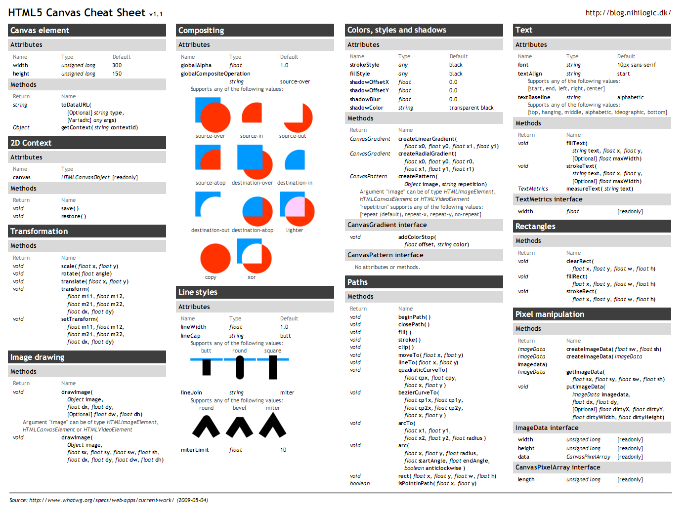

# HTML5 Canvas

<section>

## Canvas and Context

```html
<canvas width="300" height="300"></canvas>
```

```js
let canvas = document.querySelector('canvas');
let c = canvas.getContext('2d');
```

or in older browsers
```js
if (canvas.getContext) {
  var c = canvas.getContext('2d');
}
```

</section>

---

<section>

## Styling

### Colours
```
c.strokeStyle = "rgba(255,0,0,0.6)"
c.strokeStyle = "#fae432";
c.fillStyle = "#fae432";
```

### Shadows
```
c.shadowBlur = 6;
c.shadowOffsetX = 6;
c.shadowOffsetY = 6;
c.shadowColor = "orange";
```

</section>

---

<section>

## Canvas elements

### Text
```
c.fillText("Hello", x, y);
c.strokeStyle = "#fae432";
c.fillStyle = "#fae432";
```

### Rectangles
```
c.fillRect(x, y, width, height);
```

### Line
```
c.beginPath();
c.moveTo(x,y);
c.lineTo(100,40);
c.stroke();
```

### Arc and circle
```
c.beginPath();
// c.arc(x,y,r,startAngle,endAngle,drawCounterClockwise);
c.arc(100,100,30,0,Math.PI,false);
c.stroke();
```

</section>

---

<section>

## Looping draw commands
```
let x = 0;
let y = 0;
for (let i=0; i<10; i++) {
  x = window.innerWidth*Math.random(); // Math.random() produces random value between 0 and 1
  y = window.innerWidth*Math.random();

  c.beginPath();
  c.arc(x,y,5,0, Math.PI*2, false);
  c.fill();
}
```
</section>

---

<section>

## Animating canvas
```
function animateCanvas() {
  requestAnimationFrame(animateCanvas);

  c.clearRect(0,0,window.innerWidth,window.innerHeight);

  // drawing code
}
```

</section>

---

<section>

## Canvas Cheat Sheet



</section>