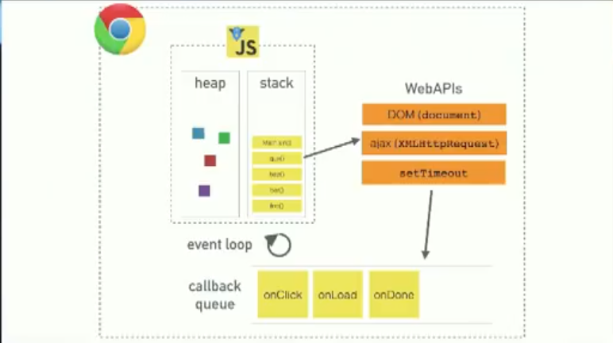

# JavaScript Basics

<section>

## Variables

### Variable Names
* a variable name must begin with a letter, underscore (`_`), or dollar sign (`$`)
* and they cannot use hyphens
* they cannot begin with numbers, although they may be used _subsequently_, e.g. `variable1`
* JavaScript is **case sensitive**

The **convention** around naming variables is to use `camelCase`

```js
var theStarterLeague = 125;
var food_truck = "Coffee";
var mixtape01 = true;
var vinyl = ['Miles Davis', 'Frank Sinatra', 'Ray Charles'];
```


### Values

Primitives
* String
* Number
* Boolean (`true` or `false`)

* `undefined`
* `null`

Objects
* Array
* Object
* Date
* Function
* Symbol
* Promise

</section>

---

<section>

## Strict mode

```js
"use strict"

// better error checking in this scope
```

</section>

---

<section>

## Statements
JavaScript is a set of statements, executed by the browser in the sequence they are written

```js
log(polaroid);
return('bicycle lane');
alert('Congratulations, you ' + outcome);
```

</section>

---

<section>

## Debugging

Pause the flow of JavaScript
* `alert()`
* `prompt()`
* `confirm()`

### Browser console

```js
console.log("Hello console!");
// provide labels for variables
console.log({ var1, var2 })
// style console log
console.log("%c Hello beautiful console", "color: pink; font-weight: bold; background-color: black;")
```

```js
console.table(array);
console.table([ var1, var2 ])
```

```js
console.assert(condition, "condition is false")
```

```js
console.error("Error!");
```

```js
console.group("group label")
console.groupCollapsed("group label")
...
console.groupEnd()
```

```js
console.dir(object)
```

```js
console.count(label)
```

```js
console.time()
console.timeLog()
```

```js
console.trace()
```


</section>

---

<section>

## Control flow


### Comparison

* `a == b`  – same value
* `a === b` – same value and same type
* `a = b`  – declaration, not a comparison!


### Loops

For-loop
```js
for (let i=0; i<10; i++) {
  // ...
}
```

For-loop over property names (i.e. indices) of an iterable (e.g. array)
```js
for (let i in arr) {
   console.log(i);
}
```

For loop over property values (i.e. array items) of an iterable (e.g. array)
```js
for (let i of arr) {
   console.log(i);
}
```

While-loop
```js
let i = 5
while (i < 10) {
   i++;
}
```

### Conditionals

```js
if (isTasty) {

} else if (isEatable) {

} else {

}
```

Shorthand
```js
const greeting = isNice ? "Hello! Nice to see you." : "Hi.";
```

### Switch

```js
switch (food) {
  case "Broccoli":
    console.log("Nice!");
    break;
  case "Carrot":
    console.log("Awesome!!");
    break;
  default:
    break;
}
```

### Try catch

```js
try {

} catch {

}
```


</section>

---

<section>

## Numbers


### Round to two decimal places

```js
parseFloat(e.offsetX).toFixed(2)
```

</section>

---

<section>

## Strings

```js
let helloString = "Hello World"
const sentence = "The quick brown fox jumps over the lazy dog."

// CREATE
// template string
const string = `My name is ${firstName}`

// Substring
string.substring(indexStart, indexEnd)
string.substring(1) // "ello World"
string.substring(0,4)

string.substr(start, length)
string.substr(0, 4)

// String contains/includes Substring
sentence.includes("dog")

// Split
const pathArray = sentence.split(' ')

// Find and replace with RegEx
const otherSentence = sentence.replace(/the/g, "a")
sentence.replaceAll("i", "ii")
```


### Regular Expression

* [Mozilla: RegEx](https://developer.mozilla.org/en-US/docs/Web/JavaScript/Reference/Global_Objects/RegExp)
* [Mozilla: Regular Expressions Guide](https://developer.mozilla.org/en-US/docs/Web/JavaScript/Guide/Regular_Expressions)


### Tagged Template
```js
custom`My name is ${firstName}`

function custom(stringsArray, ...values) {
  console.log(stringsArray, values)
}
```

```js
bold`My name is ${firstName}`

function bold(strings, ...values) {
  return values.reduce((finalString, value, index) => {
    return `${finalString}<strong>${value}</strong>${strings[index + 1]}`
  }, strings[0])
}
```

</section>

---

<section>

## Arrays

```js
let numbers = [5, 10, 15, 1, 2]
const abc = ["a", "b", "c", "a", "e"]

Array.from({ length: 5 }) // [0,1,2,3,4]
Array.from(Array(5)) // [0,1,2,3,4]
Array.from({ length: 5 }, (element, index) => index + 1) // [1,2,3,4,5]
// array from HTMLCollection
Array.from(document.getElementsByClassName('asyncImage'))

numbers.fill(1) // [1,1,1,1,1]

// Get array length
numbers.length // 3

// Get array element at index
numbers[2]    // 15
numbers.at(1) // 10

// includes
numbers.includes(2)

// index of
let list = [0,5,10,15]
const index = list.indexOf(5)
// array contains object
const fruits = ["apple", "pear", "orange"]
if (fruits.indexOf("apple") > -1) console.log("fruits contains apple")
// last index of
abc.lastIndexOf("a")

// ADD
// add a new element to an array (at the end)
numbers.push(7)
// add a new element to an array (at the beginning)
numbers.unshift(2)

// concatenate
let numbers1 = [1,2];
let numbers2 = [3,4];
let numbers = numbers1.concat(numbers2) // [1,2,3,4]

// DELETE
// delete element at the end
numbers.pop()

// delete element at the beginning
numbers.shift()

// delete element at index
delete numbers[0] // numbers[0] = undefined

// array to String
numbers.toString()
numbers.join(" - ")

// sort array
numbers.reverse()
numbers.sort()
numbers.sort((a, b) => a - b)
```

### `splice`and `slice`

`numbers.splice(spliceIndex, spliceRangeOverwrite, newArrayItems ...);`
```js
numbers.splice(3,0, 20,25); // adds 20 and 25 to numbers at index 3
numbers.splice(0,2);        // removes the first two elements
numbers.splice(2,0, "0", "1");
```

`numbers.slice(sliceBeginIndex, sliceEndIndex=array.length);`
```js
numbers.slice(3);     // subarray from index 3 upwards
numbers.slice(0,2);   // array with the first two elements
numbers.slice(1,4)
```

### Array methods
```js
const numbers = [4, -3, 9, 16, 25]
const persons = [
  { name: "John", age: 72 },
  { name: "Sally", age: 35 },
  { name: "Lisa", age: 15 },
]

// for each
numbers.forEach((item, i) => console.log(item, i))
numbers.find(item => item > 2)
numbers.every(item => item > 0)
numbers.some(item => item > 0)
numbers.findIndex(item => item === 2)

// map
numbers.map(Math.sqrt)
numbers.map(item => item*2)
persons.map(person => person.age)
// general
array.map((currentItem, index, arrayObject) => {}, thisBoundValue)

// filter
numbers.filter(value => value >= 0) // positive numbers
numbers.filter((value, index, array) => value >= 0)
// general
array.filter((elem, i, rep) => {})

// reduce
numbers.reduce((sum, number) => sum + number, 0)
```

```js
const array = [1, 2, 3, [40, 50]]

// flatten array
array.flat()
array.flat(2)
array.flat(Infinity)

// flatMap => more performant than .map().flat()
array.flatMap((currentValue, index, array) => { /* … */ } )
```

</section>

---

<section>

## Dates

```js
let date = new Date() // current date and time

new Date(year, month, day, hours, minutes, seconds, milliseconds)
new Date(year, month)
new Date(milliseconds)
new Date("2017-06-23")
new Date("2017")
new Date("2017-06-23T12:00:00-09:45")
new Date("June 23 2017")
new Date("Jun 23 2017 07:45:00 GMT+0530")

date.getDay()          // 1-31
date.getDay()          // 0-6
date.getFullYear()     // (yyyy)
date.getHours()        // 0-23
date.getMilliseconds() // 0-999
date.getMinutes()      // 0-59
date.getMonth()        // 0-11
date.getSeconds()      // 0-59
date.getTime()         // milliseconds since 1970
```

</section>

---

<section>

## Functions

```js
function sayHello(name) {
  return('Hello ' + name);
};
sayHello('Markus');
```

### Arguments
```js
function myFunction(title, name, ...) {
  console.log(arguments[1]) // "Markus"
};
myFunction("MSc", 'Markus', 15);
```


### Functional programming
```js
function Planet(mass, radius) {
  this.mass = mass
  this.radius = radius
}
const planet = Planet(10, 3)
```


### Arrow notation
```js
() => {
  // function content
}
```
```js
( properties ) => {
  // function content
}
```


### Immediately invoked function expression

```js
(function() {
  console.log("IIFE!")
})();
```


### Callback function
```js
setTimeout(callback, 1000);

function callback() {

}
```


### Workaround: Named parameters

Pass objects to function calls (using object destructuring)

```js
perform({ oneRequired: "Yes!", threeOptional: true })

function perform({ oneRequired, twoOptional = null, threeOptional = false } = {}) {
   // ...
}
```

### Generator function

Generator function denoted by `*` after `function` keyword
```js
function* idGenerator() {
  let id = 1

  while (true) {
    yield id
    id++
  }
}

const generator = idGenerator()
const id1 = generator.next()
const id2 = generator.next()
```

## `bind`, `call`, `apply`
```js
let a = { name: "A" }
let b = { name: "B" }
function speak(arg) { console.log(this.name, arg)  }

speak.bind(b)()
speak.bind(b)("argument")
speak.bind(b, "argument").call()
speak.bind(b).call("argument", ...)

speak.apply(a)
```

</section>

---

<section>

## JavaScript Event Loop



### Call Stack
single threaded = single callstack = one thing at a time

### Web APIs

pushed to task queue when done


### Callback/Task Queue


### Event Loop
If stack is empty, task pending in the task queue is pushed onto the stack.

</section>

---

<section>

## Objects | Object Literal

* objects = collection of key and value pairs
* keys = properties
* values


```js
var school = {
    name: 'The Starter League',
    location: 'Merchandise Mart',
    students: 120,
    teachers: ['Jeff', 'Raghu', 'Carolyn', 'Shay'],
    calculate: (input) => input**2
}
const object = {
  title: "The Old Man and the Sea",
  author: "Earnest Hemingway",
  year: "1952",
  getSummary: function() {
    return `${this.title} was written by ${this.author} in ${this.year}`;
  }
}
const person = { name: "Max", age: 25 }

// Create object via `new`
wordData = new Object()

// get all property keys and values (as arrays)
Object.keys(myObject)
Object.values(myObject)

// check if key exists
if (person.name)                  {  }
if ("key" in object)              {  }
if (object.hasOwnProperty('key')) {  }

// access property
school['name']
school.name

// set property
school.name = "High School"
school.age = 350            // new property

// 
Object.defineProperty(object, "name", {
  writable: false,
  value: undefined,
  configurable: false,
  enumerable: false,
  get()         { return this.name },
  set(newValue) { this.name = newValue }
})

// 2-way data binding
const inputElement = document.querySelector("input")
const inputObject  = {}

Object.defineProperty(inputObject, "name", {
  get() {
    return inputElement.value
  },
  set(newValue) {
    inputElement.value = newValue
  }
})

```


</section>

---

<section>

## Objects | Function definition

### Constructor
Example 1
```js
function Book(title, author, year) {
  this.title  = title;
  this.author = author;
  this.year   = year;

  this.getSummary = function() {
    return `${this.title} was written by ${this.author} in ${this.year}`;
  }
}

// Instantiate an Object
const book = new Book("The Old Man and the Sea", "Earnest Hemingway", "1952");
```

Example 2
```js
function Circle(x,y,r) {
  this.x = x;
  this.y = y;
  this.r = r;

  this.draw = function () {
    // draw
  }
}

let circle = new Circle(10,20, 5);
circle.draw();
```


### Prototype
```js
function Book(title, author, year) {
  this.title  = title;
  this.author = author;
  this.year   = year;
}

Book.prototype.getSummary = function() {
  return `${this.title} was written by ${this.author} in ${this.year}`;
}

Book.prototype.revise = function(newYear) {
  this.year = newYear;
  this.revised = true;
}
```


### Inheritance

```js
function Lexicon(title, author, year, partNumber) {
  Book.call(this, title, author, year);

  this.partNumber = partNumber;
}

// Inherit Prototype
Magazine.prototype = Object.create(Book.prototype);

// Use Lexicon Constructor
Lexicon.prototype.constructor = Lexicon;

const lexicon3 = new Lexicon("Mammals", "Charles Darwin", "1940", "3");
```


### Object Create
```js
// Object of prototype functions
const bookProtos = {
  this.getSummary: function() {
    return `${this.title} was written by ${this.author} in ${this.year}`;
  },
  this.revise = function(newYear) {
    this.year = newYear;
    this.revised = true;
  }
}

// Create object
const book = Object.create(bookProtos);
book.title = "The Old Man and the Sea";
book.author = "Earnest Hemingway";
book.year = "1952";

// Create object
const book2 = Object.create(bookProtos, {
  title: { value: "The Old Man and the Sea" },
  author: { value: "Earnest Hemingway" },
  year: { value: "1952" }
});
```

</section>

---

<section>

## Classes (ES6+)
```js
class Book {
  constructor(title, author, year) {
    this.title = title;
    this.author = author;
    this.year = year;
  }

  getSummary() {
    return `${this.title} was written by ${this.author} in ${this.year}`;
  }

  revise(newYear) {
    this.year = newYear;
    this.revised = true;
  }

  static topBookStore() {
    return "Barnes & Noble";
  }
}

// Instantiate Book object
const book1 = new Book("The Old Man and the Sea", "Earnest Hemingway", "1952");

console.log(Book.topBookStore());
```

### Subclasses
```js
class Lexicon extends Book {
  constructor(title, author, year, partNumber) {
    super(title, author, year);
    this.partNumber = partNumber;
  }
}

// Instantiate Lexicon object
const lex = new Lexicon("Mammals", "Charles Darwin", "1940", "3");
console.log(lex.getSummary());
```


### Class File
```js
class Duck extends Bird {
  constructor(name, size, isAbleToSwim, isAbleToFly, quack) {
    super(name, size, isAbleToSwim, isAbleToFly);
    this.quack = quack;
  }
}

export default Duck;
```

### Setters and getters
```js
class BirdsNest {

  set eggsCount(numberOfEggs) {

  }

  get eggsCount() {

  }
}
```

</section>

---

<section>

## Destructuring

```js
const [a, b, ...c] = [5,10,15,20];
```

```js
let [a, b] = [1,2];
```

```js
let {a, b, ...c} = {a: 10, b: 20, c: 30, d: 40};
```

```js
({a, b} = {a: 10, b: 20});
```

```js
const data = { foo: 45, bar: 23, name: 'Poppy' };

// subset
const { name, ...rest } = data;
console.log(rest) // { foo: 45, bar: 23 }

// renaming
const { name: firstName, foo: age };
console.log(firstName, age) // "Poppy", 45

// defaults
const { len: length = 0 } = {};
console.log(length) // 0
```

</section>

---

<section>

## JSON

```js
JSON.parse(jsonString)
JSON.stringify(object)
```

</section>

---

<section>

## Errors

```js
try {
  dangerousCall()
} catch(error) {
  console.log(error)
}
```

```js
try {
  if (x == "") throw "empty"
  if (isNan(x)) throw "not a number"
  x = Number(x)
} catch(error) {
  console.error(error)
} finally {
  console.log("done")
}
```

</section>

---

<section>

## ES6 JavaScript Modules

```html
<script type="module" src="main.js"></script>
```

```js
Named Export
* `var`
* `let`
* `const`
* `function`
* `class`

```js
export const name = 'apple';
export function drawApple() { … }

export at the end of a file
export { name, drawApple };

export {
  function1 as firstFunction,
  function2 as secondFunction
};
```

Named Import
```js
import { name, drawApple } from './modules/apple.js';

import {drawApple as createApple} from './modules/apple.js';
```

Default Export
```js
export default peachName;

export default function(context) { … }
```

Import Default
```js
import drawPeach from './modules/peach.js';
```

Namespacing
```js
import * as Module from './modules/module.js';

Module.function1()
Module.function2()
```


### Dynamic Module Loading

```js
import('./modules/myModule.js')
  .then((Module) => {
    // Do something with the module.
    const square = new Module.Square(canvas.context)
    square.draw();
  });
```

</section>
