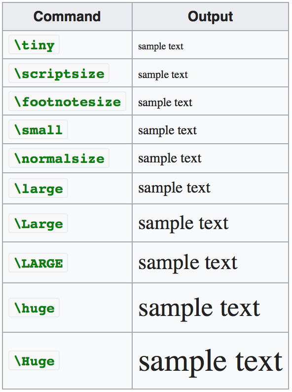

# LaTeX

<section>

## Basics

### Box
```tex
\boxed{ formula }
```

### Color
* [RGB Color](http://www.tayloredmktg.com/rgb/)

```tex
{ \color{gray} some text or other objects }
```

```tex
\textcolor{WildStrawberry}{i}
\textcolor{ForestGreen}{m}
```

```tex
\colorbox{VioletRed}{$a_{11}$}
\colorbox{Cyan}{$b_{11}$}
\colorbox{Orchid}{$c_{11}$}
```

#### Coloring table lines / columns
* [Highlight table rows&columns with color](https://texblog.org/2011/04/19/highlight-table-rowscolumns-with-color/)

preamble
```tex
\usepackage{color, colortbl}

\definecolor{LightCyan}{rgb}{0.88,1,1}

\newcolumntype{a}{>{\columncolor{Gray}}c}
```

use in the table
```tex
\begin{table}[ht]
  \centering
  \begin{tabular}{c|cacacacac}
    \hline
    & col1 & col2 & col3 & col4 & col5 & col6 & col7 \\
    \hline
    \rowcolor{LightCyan}
    row1& \ra & \ra & \ra & \ra & \ra & \ra & \ra \\
    row2& \ra & \ra & \ra & \ra & \ra & \ra & \ra \\
    \rowcolor{LightCyan}
    row3& \ra & \ra & \ra & \ra & \ra & \ra & \ra \\
    row4& \ra & \ra & \ra & \ra & \ra & \ra & \ra \\
    \rowcolor{LightCyan}
    row5& \ra & \ra & \ra & \ra & \ra & \ra & \ra \\
    row6& \ra & \ra & \ra & \ra & \ra & \ra & \ra \\
    \hline
  \end{tabular}
\end{table}
```


### Figure
```tex
\begin{figure}[h!]
	\centering
    	\includegraphics[width=0.3\textwidth]{ImageName}
	\caption{ Description of the picture. }
	\label{img}
\end{figure}
```

### Subfigure
```tex
\usepackage{subcaption}
```

```tex
\begin{figure}[h]
    \centering
    \begin{subfigure}[b]{0.49\textwidth}
        \centering
        \includegraphics[width=1.0\textwidth]{image1}
        \caption{}
        \label{}
    \end{subfigure}
    \begin{subfigure}[b]{0.49\textwidth}
    	\centering
        \includegraphics[width=1.0\textwidth]{image2}
        \caption{ }
        \label{}
    \end{subfigure}
\caption{  }
\end{figure}
```

### Table
```tex
\begin{table}[h!]
	\renewcommand{\arraystretch}{2.0}
	\centering
	\begin{tabular}{r|l}
		\multicolumn{2}{|c|}{AB}
		a	 & 		b	\\ \hline
	\end{tabular}
\end{table}
```

### Matrix
```tex
\begin{pmatrix}
	a & a & a \\
	a & a & a \\
	a & a & a
\end{pmatrix}
```

### Sizes
* Change the size within a given scope, e.g.
```tex
{\Large some words}
```




</section>

---

<section>

## Bibtex Bibliography

`file.tex`
```tex
...
\cite{citationID}
...
\bibliographystyle{unsrturl}
\bibliography{sources}
...
```


`sources.bib`
```tex
@article{citationID,
      author         = "Kallosh, Renata and Linde, Andrei",
      title          = "{Multi-field Conformal Cosmological Attractors}",
      journal        = "JCAP",
      volume         = "1312",
      year           = "2013",
      pages          = "006",
      doi            = "10.1088/1475-7516/2013/12/006",
      eprint         = "1309.2015",
      archivePrefix  = "arXiv",
      primaryClass   = "hep-th",
      SLACcitation   = "%%CITATION = ARXIV:1309.2015;%%"
}

@article {citationID,
author = "Wrase, Timm",
title = "Lecture Notes: dS Vacua and Inflation in String Theory",
year = "2016",
url={https://indico.jinr.ru/getFile.py/access?contribId=11&sessionId=7&resId=0&materialId=2&confId=97}
}
```

Create Bibtex source automatically:
- [Bibtex source generator](https://arxiv2bibtex.org)

</section>

---

<section>

## TikZ

* [3D Bodies in TikZ](https://tex.stackexchange.com/questions/42812/3d-bodies-in-tikz)

Preamble
```tex
\usepackage{tikz}
\usetikzlibrary{3d,calc}
```

Drawing with TikZ
```tex
\begin{tikzpicture}
    \draw (-1,0) arc (180:360:1cm and 0.5cm);
    \draw[dashed] (-1,0) arc (180:0:1cm and 0.5cm);
    \draw (0,1) arc (90:270:0.5cm and 1cm);
    \draw[dashed] (0,1) arc (90:-90:0.5cm and 1cm);
    \draw (0,0) circle (1cm);
    \shade[ball color=blue!10!white,opacity=0.20] (0,0) circle (1cm);
\end{tikzpicture}
```

```tex
\begin{tikzpicture}
    \draw (-1,0) arc (180:360:1cm and 0.5cm) -- (0,3) -- cycle;
    \draw[dashed] (-1,0) arc (180:0:1cm and 0.5cm);
    \shade[left color=blue!5!white,right color=blue!40!white,opacity=0.3] (-1,0) arc (180:360:1cm and 0.5cm) -- (0,3) -- cycle;
\end{tikzpicture}
```

```tex
\begin{tikzpicture}
    \draw (-1,0) arc (180:360:1cm and 0.5cm);
    \draw (-1,0) arc (180:0:1cm and 0.5cm);
    \draw (-2,-3) arc (180:370:2cm and 1cm);
    \draw[dashed] (-2,-3) arc (180:10:2cm and 1cm);
    \draw(-2,-2.9)  -- (-1,0);
    \draw(2,-2.9)   -- (1,0);
    \shade[left color=blue!5!white,right color=blue!60!white,opacity=0.3] (-1,0) arc (180:360:1cm and 0.5cm) -- (2,-3) arc (360:180:2cm and 1cm) -- cycle;
    \shade[left color=blue!5!white,right color=blue!60!white,opacity=0.3] (0,0) circle (1cm and 0.5cm);
\end{tikzpicture}
```

</section>