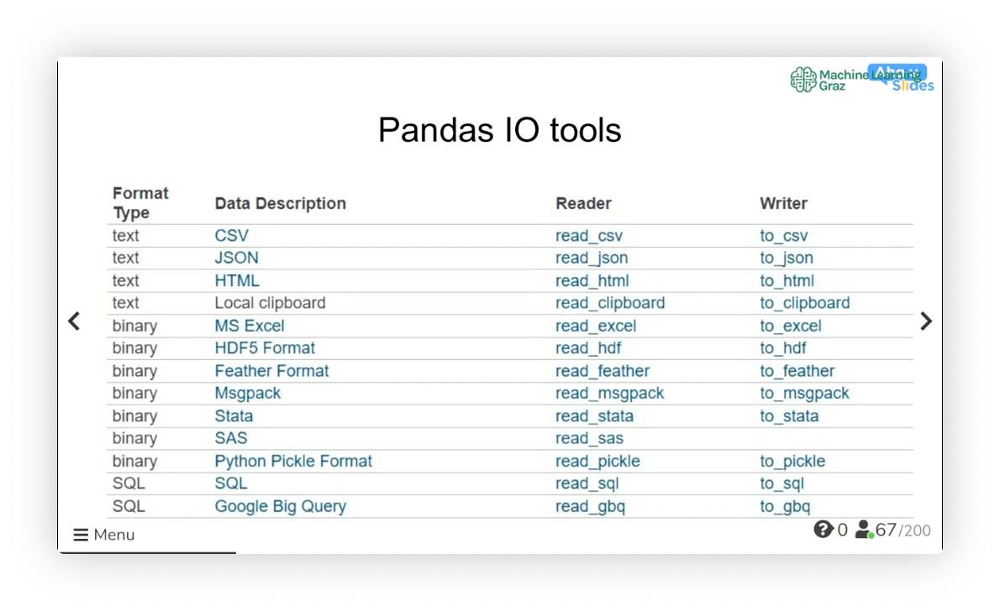
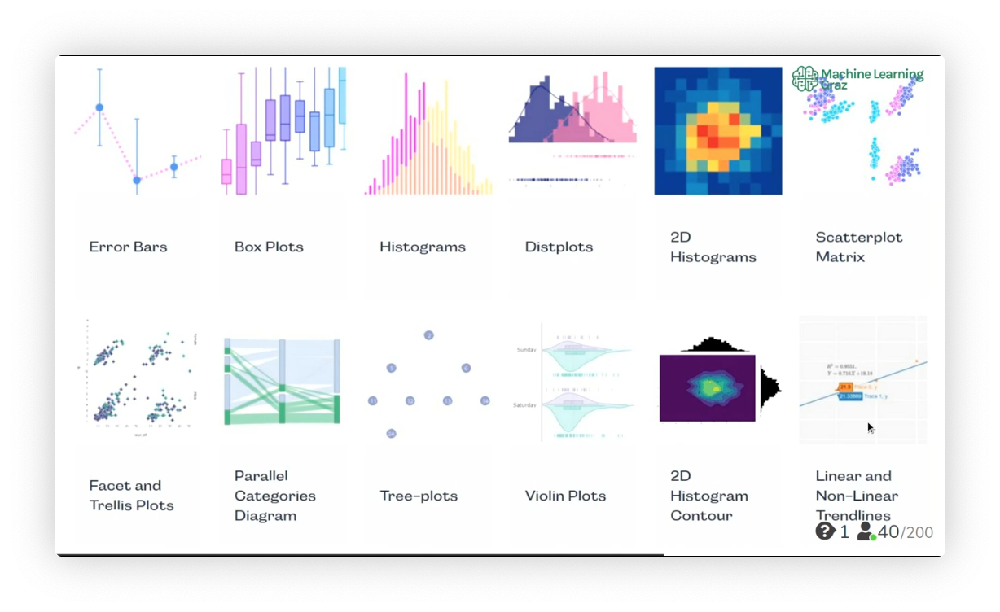

# Working with Data

TODO
Figure out primitive list structure of
* numpy array
* pandas DataFrame


<section>

## Data Science

### Tools
* Python
* Pandas - working with table data
* Numpy - working with matrix structures
* Plotly
    * `pip install plotly`
    * `conda install -c plotly plotly`
* RFPImp
    * `pip install rfpimp`
    * `conda install -c conda-forge rfpimp`
* Tensorflow
    * `pip install tensorflow`
    * `conda install -c conda-forge tensorflow`

**Info:**
For `zsh`, one needs to include this in `.zshrc`
```
source /.bash_profile
```

</section>

---

<section>

## Pandas

```python
import pandas as pd
```

### Reading and writing

#### Data Formats
* CSV - comma-separated values
* XLSX - Excel (based on XML)
* JSON - JavaScript Object Notation
* HTML



#### CSV Structure

```
ID, Name, Age, City
0, Tim, 25, Vienna
1, Angelica, 29, Bern
2, Alex, 31, Milano
```

Separators
* `,` – typically comma-separated values
* `;` – Excel output
* `\t`
* `#`

#### Read a CSV file (into a pd.DataFrame)

```python
import pandas as pd
df = pd.read_csv('example.csv', sep=';')
df
```


#### Read a XLSX file (into a pd.DataFrame)


```python
import pandas as pd
df = pd.read_excel('example.xlsx', sheet_name='Sheet1')
df
```


#### Read a JSON file (into a pd.DataFrame)

```python
import pandas as pd
df = pd.read_json('example.json')
df
```


### DataFrame

Obtain `(rows, columns)`

```python
df.shape
```


Show first 5 rows of data

```python
df.head()
```


Get column names

```python
df.columns
```


Drop any duplicates (overwrite df)

```python
df = df.drop_duplicates()
```


Drop NaN values

```python
df = df.dropna()
```


Sum not-a-number values

```python
df.Price.isna().sum()
```


Sum "null" (no-value) values

```python
df.isnull().sum()
```


Check sum (to check whether data was transferred completly, without corruption)

```python
df.numberDataColumn.sum()
```


Check occurrences of values

```python
df.jobs.unique()        # list of unique values
df.jobs.nunique()       # number of unique values
df.jobs.count()         # count values
df.jobs.value_counts()  # list & number of values
df.income.value_counts()/df.income.shape[0] # relative number of values
```

Univariate analysis of data in column

```python
df.age.describe()  # statistics like mean, min/max etc.
df.age.median()    # median
df.age.mean()      # mean
df.age.min()       # min
df.age.max()       # max
```


**Impute missing values**
with most frequent value
```python
categorical_columns_missing = ["Gender", "Married"]

impute_missing = SimpleImputer(missing_values=np.NaN, strategy='most_frequent')

df[categorical_columns_missing] = impute_missing.fit_transform(df[categorical_columns_missing])
```

with mean value
```python
impute_missing = SimpleImputer(missing_values=np.NaN, strategy='mean')

df["Amount"] = impute_missing.fit_transform(df[["Amount"]])
```


**Queries in Pandas**

```python
df[df.job == "engineer"]
```


Query for data in a column

```python
developers = df[df.job.isin(["developer", "programmer"])].index
wealthy    = df[df.income > 50000].occupation
wealthySalesperson = df[(df.occupation == "Salesperson") & (df.income > 50000)].shape[0]
```


Delete column(s)

```python
df = df.drop(labels='Jobs', axis=0)     # axis=0 deletes row
df = df.drop(['Col1', 'Col2'], axis=1)  # axis=1 deletes column
```


Create new column

```python
df["capital"] = df.capital_gain - df.capital_loss
```


Multiply the whole DataFrame by factor and round (e.g. fraction to percent)
```python
df *= 100
df = df.astype(float).round(1)
```


Rename last column

```python
df.columns = list(df.columns.values[:-1]) + ["newName"]
```


#### Replace entries

Example: Save lines to variable; Use lines to rewrite the values in the "job" column

```python
engineers = df[df.job == "engineer"].index
engineers = df.loc[engineers, "job"] = "Engineer"
```

Replace

```python
df.replace(to_replace = ["A", "B"], value ="AB") 
df.replace(to_replace = np.nan, value = -1)
```

Replacing commas

```python
df.apply(lambda x: x.str.replace(',','.'))
```


#### Sort

```python
df.sort_values(by="price")
df.sort_values(by=["AveragePrice"])
```


#### Group by

*Group by* values in column

```python
df.groupby("name") 
df.groupby(["name", "age"]) 
```

returns groupby object (not a DataFrame!) that accepts manipulations such as `mean()` etc.

```python
df.groupby(["occupation"]).salary.mean()
df.groupby(["occupation"]).salary.min()
df.groupby(["firstCategory", "secondCategory"]).count()["id"]
```


Reset index (to get back a DataFrame)

```python
df.groupby(["occupation"]).salary.mean().reset_index()
```


Get one of the groups

```python
df_group = df.get_group("GroupA")
```


#### Creating a DataFrame

Create DataFrame
```python
df = pd.DataFrame({
                    'Year'  : year_list,
                    'Month' : month_list,
                    'Day'   : day_list
                  })
```

Create DataFrame with specified rows and columns
```python
df = pd.DataFrame(index=['row1', 'row2', ...], columns=['column 1', 'column 2'])

for row_key in df.index:
  df[row_key] = [column_1[row_key], column_2[row_key]]
```


Loop through rows in DataFrame

```python
for i, row in df.iterrows():
    print(df['Column1'][i])
    print(row['Column1'])
```


DataFrame from dictionary
```python
data = {'name': [name], 'money': [money]}
df = pd.DataFrame(data, columns=["name", "money"])
```


#### Split a DataFrame
```python
df_first500 = df.iloc[:500, :,]
df_501up    = df.iloc[500:, :,]
```


### Pandas and NumPy
```python
import pandas as pd
import numpy as np
```

create data frame

```python
data = {
    'name': ['Eric', 'Lisa', 'John'],
    'age': [38,25,44],
    'salary': [13000, 2000, 8000]
}
df = pd.DataFrame(data)
```

data frame --> numpy array

```python
np_array = df.to_numpy()
```

single column --> numpy array

```python
np_array = df['age'].to_numpy()
```

multiple columns --> numpy array

```python
np_array = df[['age', 'salary']].to_numpy()
```

integer valued columns --> numpy array

```python
df.select_dtypes(include=int64).to_numpy()
```


</section>

---

<section>

## Numpy

```python
import numpy as np
```

Mean
```python
np.mean(list_of_numbers)
```

</section>

---

<section>

## Matplotlib

```python
import matplotlib.pyplot as plt
```


### Simple Pandas Visualisation

Histograms (1D, univariate)
```python
df.age.hist()
```


Count Plot (1D, univariate)
```python
df.workclass.value_counts().plot(kind="bar")
```


Scatter Plot (2D, bivariate)
```python
df.plot.scatter("age", "capital")
```


Linear Correlation (2D, bivariate)
```python
df.corr()
```

### Plot
```python
fig, ax = plt.subplots()
ax.plot(x, x, label='linear')
ax.plot(x, x**2, label='quadratic')
ax.plot(x, x**3, label='cubic')
ax.set_xlabel('x label')
ax.set_ylabel('y label')
ax.set_title("Simple Plot")
ax.legend()
```

</section>

---

<section>

## Plotly (Express)

```python
import plotly.express as px
```





### Plot categories

Histogram

```python
px.histogram(data_frame=df, x="xColumn", title="My Title")
```


Stacked histogram (with more than one category)

```python
px.histogram(df, x="xColumn", color="typeColumn", title="My Title")
```


Box Plot

```python
px.box(df, y="columnName")
```


Stacked box plot (with more than one category)

```python
px.box(df, y="dataColumn", x="categoryColumn")
```


Line Plot

```python
px.line(df, x="date", y="price")
```


Stacked line plot

```python
px.line(df, x="date", y="price", color="type")
```


Bar Plot

```python
px.bar(df, x="price", y="region", orientation="h") # default: h(orizontal)
px.bar(df, x="region", y="price", orientation="v")
```


Stack bar plot

```python
px.bar(df, x="price", y="region", color="type")
```


Stack side-by-side bar plot

```python
px.bar(df, x="price", y="region", color="type", barmode="group")
```


Scatterplot

```python
px.scatter(df, x="price", y="amount")
```


### Enhancing plot styles

```python
fig = px.bar(df_profit_per_city, 
            y="city", 
            x="profit", 
            orientation="h", 
            color="city",
            barmode='group',
            title="Plot Title",
            color_discrete_sequence=["red", "blue"]
      )

fig.update_layout(
    xaxis_title="profit (in €)",
    showlegend=False
    )

fig.show()
```


</section>

---

<section>

## 


</section>

---

<section>

## 


</section>

---

<section>

## Geopandas

### Resources
* [swaroopch.com](https://python.swaroopch.com/preface.html)
* [matplotlib: pyplot](https://matplotlib.org/tutorials/introductory/pyplot.html)
* [geopandas](http://geopandas.org/mapping.html)
* [Good geopandas youtube tutorial](https://www.youtube.com/watch?v=wsSEKm-rU6U)


```python
import numpy as np
import matplotlib.pyplot as plt #Plot
import pandas as pd	#DataFrames, Excel
import series as ser	#benummerte Columns
import geopandas as gpd
```

### Python Mapping with GeoPandas


Data that comes with GeoPandas

```python
world = gpd.read_file(gpd.datasets.get_path('naturalearth_lowres'))
```

Data structure

```python
world.head()
```

Coordinate reference system (CRS)

```python
world.crs
world.plot(color='grey', linewidth=0.5, edgecolor='white', figsize=(15,10))
```


Custom data (shape file)

```python
import os
data_path = "../Data/"

cities = gpd.read_file(os.path.join(data_path, "ne_10m_populated_places.shp"))

cities.head()

cities.crs

cities.plot(figsize=(15,10), color='orange', markersize=5)
```


Join two geographical data sets

```python
world.crs == cities.crs

base = world.plot(color='grey', linewidth=0.5, edgecolor='white', figsize=(15,10))
cities.plot(ax=base, color='orange', markersize=5)
base.set_axis_off()
```

</section>