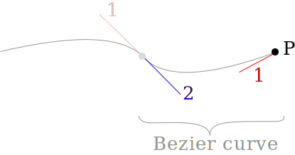

<link href="../assets/style.css" rel="stylesheet">


# SVG

<section>

## Basics

**Viewport** is the size of the *viewable* area, determined by the `width` and `height` attributes.

**Viewbox** controls what shows up in the viewable area, determined by the `viewBox` attribute.

<figure class="fig-1-3">

<svg width="100px" height="100px" viewBox="0 0 50 50" version="1.1" xmlns="http://www.w3.org/2000/svg">
  <rect width="10" height="10" fill="#226600" />
</svg>

```xml
<svg width="100px" height="100px" viewBox="0 0 50 50" version="1.1" xmlns="http://www.w3.org/2000/svg">
  <rect width="10" height="10" />
</svg>
```

</figure>

</section>

---

<section>

## Useful References
* [MDN SVG Basic Shapes](https://developer.mozilla.org/en-US/docs/Web/SVG/Tutorial/Basic_Shapes)
* [Clean SVG-File with SVG OMG](https://jakearchibald.github.io/svgomg/)
* [SVG.js](https://svgjs.com/docs/3.0/)

</section>

---

<section>

## Shapes

### Rectangle
<figure class="fig-1-3">
<svg width="100" height="100" viewBox="0 0 100 100" version="1.1" xmlns="http://www.w3.org/2000/svg">
  <rect x="10" y="10" rx="10" ry="10" width="80" height="80" stroke="gray" fill="transparent" stroke-width="5"/>
</svg>

```xml
<rect x="10" y="10" rx="10" ry="10" width="80" height="80" stroke="gray" fill="transparent" stroke-width="5"/>
```

</figure>


### Circle
<figure class="fig-1-3">
<svg width="100" height="100" viewBox="0 0 100 100" version="1.1" xmlns="http://www.w3.org/2000/svg">
  <circle cx="50" cy="50" r="40" stroke="red" fill="transparent" stroke-width="5"/>
</svg>

```xml
<circle cx="50" cy="50" r="40" stroke="red" fill="transparent" stroke-width="5"/>
```

</figure>

### Ellipse
<figure class="fig-1-3">
<svg width="100" height="100" viewBox="0 0 250 250" version="1.1" xmlns="http://www.w3.org/2000/svg">
  <ellipse cx="75" cy="75" rx="20" ry="5" stroke="red" fill="transparent" stroke-width="5"/>
</svg>

```xml
<ellipse cx="75" cy="75" rx="20" ry="5" stroke="red" fill="transparent" stroke-width="5"/>
```

</figure>


### Line
<figure class="fig-1-3">
<svg width="100" height="100" viewBox="0 0 250 250" version="1.1" xmlns="http://www.w3.org/2000/svg">
  <line x1="10" x2="50" y1="110" y2="150" stroke="orange" stroke-width="5"/>
</svg>

```xml
<line x1="10" x2="50" y1="110" y2="150" stroke="orange" stroke-width="5"/>
```

</figure>

### Polyline
<figure class="fig-1-3">
<svg width="100" height="100" viewBox="0 0 250 250" version="1.1" xmlns="http://www.w3.org/2000/svg">
  <polyline points="60 110 65 120 70 115 75 130 80 125 85 140 90 135 95 150 100 145"
      stroke="orange" fill="transparent" stroke-width="5"/>
</svg>

```xml
<polyline points="60 110 65 120 70 115 75 130 80 125 85 140 90 135 95 150 100 145"
    stroke="orange" fill="transparent" stroke-width="5"/>
```

</figure>


### Polygon
<figure class="fig-1-3">
<svg width="100" height="100" viewBox="0 0 250 250" version="1.1" xmlns="http://www.w3.org/2000/svg">
  <polygon points="50 160 55 180 70 180 60 190 65 205 50 195 35 205 40 190 30 180 45 180"
      stroke="green" fill="transparent" stroke-width="5"/>
</svg>

```xml
<polygon points="50 160 55 180 70 180 60 190 65 205 50 195 35 205 40 190 30 180 45 180"
    stroke="green" fill="transparent" stroke-width="5"/>
```

</figure>

### Path
<figure class="fig-1-3">
<svg width="100" height="100" viewBox="0 0 250 250" version="1.1" xmlns="http://www.w3.org/2000/svg">
  <path d="M20,230 Q40,205 50,230 T90,230" fill="none" stroke="blue" stroke-width="5"/>
</svg>

```xml
<path d="M20,230 Q40,205 50,230 T90,230" fill="none" stroke="blue" stroke-width="5"/>
```

</figure>

</section>

---

<section>

## SVG Path

### SVG Path Vocabulary
move starting point
- `M` = move to

lines
- `L` = line to
- `H` = horizontal line to
- `V` = vertical line to

curves
- `C` = curve to
- `S` = smooth curve to
- `Q` = quadratic Bézier curve
- `T` = smooth quadratic Bézier curve to

arc
- `A` = elliptical arc

close path
- `Z` = close path

NB: Capital letters means **absolutely positioned**, lower cases means **relatively positioned**.


### Curves


A curve takes three parameters:
1. the handle from the previous point [2]
2. the handle from the current point [1]
3. the current point [P]

```xml
<path d="M0 0 C30 30 80 10 100 0">
```

</section>
