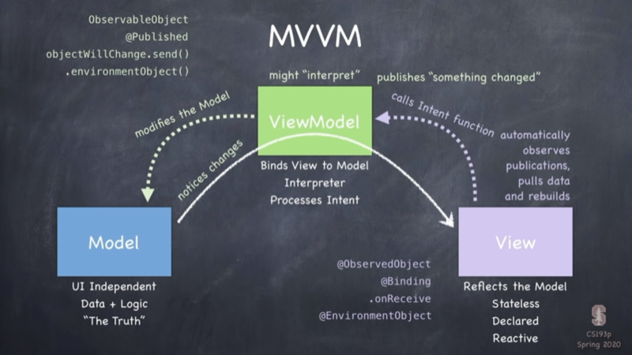

# SwiftUI

<section>

## MVVM: Model - View - ViewModel

`ContentModel.swift`
```swift
import Foundation

struct ContentModel {
    var content: String
  
    mutating func performIntent() {
        content = "Hello " + content
    }
}
```

`ContentViewModel.swift`
```swift
import SwiftUI

class ContentViewModel: ObservableObject {
  @Published private(set) var contentModel: ContentModel
  
  init(content: String) {
    contentModel = ContentModel(content: content)
  }
  
  // MARK: Intent(s)
  func performIntent() {
    contentModel.performIntent()
  }
}
```

`ContentView.swift`
```swift
import SwiftUI

struct ContentView: View {
    @ObservedObject var contentViewModel: ContentViewModel
    
    var body: some View {
        Text(contentViewModel.contentModel.content)
          .onTapGesture {
            contentViewModel.performIntent()
          }
          .frame(width: 100, height: 100)
    }
}
```



</section>

---

<section>

## Views and Modifiers 

* Views
    * Image Assets
    * Color Assets
* Modifiers


### Common Views

```swift
Text("Hello SwiftUI")
  .font(.subheadline)
  .foregroundColor(.secondary)

Text("Fancy")
  .font(.system(size: 20, weight: .bold, design: .rounded))
```

```swift
Image(update.image)
  .resizable()
  .aspectRatio(contentMode: .fit)
```


### View Combiners

```swift
HStack { 
  
}
```

```swift
VStack { 

}
```

```swift
ZStack { 
  RoundedRectangle(cornerRadius: 10)
  Text("🍏")
}
```

```swift
ForEach(image) { image in
  Image(image)
    .resizable()
    .frame(height: 100)
}
```


### Modifiers

Full width text
```swift
Text("")
  .frame(maxWidth: .infinity, alignment: .leading)
```

Modal View
```swift
Button(action: { self.sheetPresented.toggle() }) {
  Text("Button")
}
.sheet(isPresented: $sheetPresented) {
  ContentView()
}
```
</section>

---

<section>

## Data flow primitives / Properties

```swift
@State var showUpdate = false
@Binding var showProfile: Bool
@Published var updates: [Update] = updateData
@ObservedObject var store = UpdateStore()
```

Binding properties denoted by `$`-prefix, e.g.
```swift
ViewWithBinding(bindingVariable: $variable)
```


### Combine 
Store Class
```swift
import SwiftUI
import Combine

class UpdateStore: ObservableObject {
  @Published var updates: [Update] = updateData
}
```

```swift
@ObservedObject var store = UpdateStore()

// store.updates
```


### Binding state variables in a subview

```swift
struct Home: View {
  @State var state: Bool

  var body: some View {
    // …
    ExtractedView(subviewState: $state)
    // …
  }
}
```

```swift
struct ExtractedView: View {
  @Binding var subviewState: Bool

  // …
}
```

</section>

---

<section>

## @State

```swift
struct ContentView: View { 
  @State var dragOffset: CGSize

  // ...
}
```

</section>

---

<section>

## Observable Object

```swift
class ViewModel: ObservableObject { 
  @Published private var model
}
```

```swift
struct ContentView: View { 
  @ObservedObject var viewModel: ViewModel

  // ...
}
```

</section>

---

<section>

## Geometry

### Positioning

* `.offset` Modifier (aka relative position)
* `.position` Modifier (aka absolute position)
* Alignment
  * `.leading`
  * `.trailing`
  * `.trailing`


### SwiftUI Coordinate Spaces

* `.global`
* `.local`
* `.named("XYZ")`

Modifier:
`View().coordinateSpace("XYZ")`

### Detect Screen Size

```swift
let screen = UIScreen.main.bounds
screen.height
screen.width
```


### GeometryReader

```swift
GeometryReader { geometry in
  // geometry.frame(in: .global).minX
  // geometry.size
}
```


</section>

---

<section>

## Animation

### Implicit Animation


### Explicit Animation


### Transitions


</section>

---


---

<section>

## Gestures


</section>