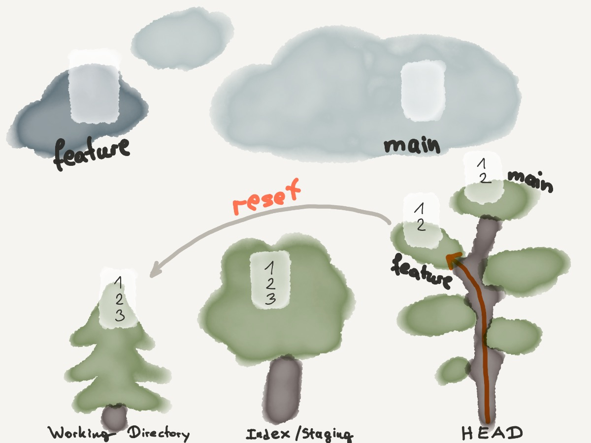

<link href="../assets/style.css" rel="stylesheet">

# Git

<section>

## Git Overview

### Resources
* [Git Guide](https://rogerdudler.github.io/git-guide/index.html)
* [Feature Branch Workflow](https://www.atlassian.com/git/tutorials/comparing-workflows/feature-branch-workflow)
* [Github Cheat Sheet](https://github.github.com/training-kit/downloads/github-git-cheat-sheet/)
* [Cool interactive Git Cheat Sheet](http://ndpsoftware.com/git-cheatsheet.html)

### Workflow
A local repository consists of three "trees" maintained by Git.
1. a **Working Directory** which holds the actual files
2. the **Index** which acts as a staging area 
3. the **HEAD** which points to the last commit made

### Defaults:
* `remote`: `origin`
* `branch`: `main`

</section>

---

<section>

## Github Workflow

**Rename a local git branch**
```
git branch -m new-name
git branch -m old-name new-name
```

**Create new branch on Github and locally**
```
git branch --set-upstream-to=origin/new-feature new-feature
```

**Push new branch**
```
git checkout -b new-feature
git commit ...
git push origin new-feature 
git push --set-upstream origin new-feature
```

**Pull new branch from Github**

``` shell
# see all branches
git branch -a

# see only remote branches
git branch -r

# pull and checkout new branch
git pull
git checkout new-branch
```

**Delete branch from Github**
```
git push origin --delete branch-name
```

**Delete branch locally**
```
git branch -d branch-name
```


</section>

---

<section>

## Configure Git

<figure class="fig-1-2">

<div>

Configure Git

</div>
<div>

```shell
git config --global user.name "User Name"
git config --global user.email "username@icloud.com"
git config --global --edit ...

git config --global color.ui auto
git config --global color.ui tree
git config format.pretty oneline
```

Saving Github password (by storing the login credentials in plain text)
```bash
git config --global credential.helper store
```

</div>
</figure>
</section>

---

<section>

## Initialize Git Repository

<figure class="fig-1-2">


Initialize Git repository
```shell
git init
```

</figure>
</section>

---

<section>

## Remote

<figure class="fig-1-2">

Add remote origin
```shell
git remote add origin [url]
```

update remote branches
```git
git remote update origin --prune
```

</figure>
</section>

---

<section>

## Clone repository

<figure class="fig-1-2">


<div>

```shell
git clone [url]
```

when using a remote server, your command will be
```shell
git clone username@host:/path/to/repository
```

or via Github/Gitlab
```shell
git clone https://github.com/vuejs/vuejs.org.git
git clone --recursive https://gitlab.cern.ch/tdr/notes/AN-19-031.git
```

</div>
</figure>
</section>

---

<section>

## Add

<figure class="fig-1-2">


<div>

```shell
git add [file]
git add -- [file1] [file2]
git add -- .
git add .
```

interactive
```shell
git add -i
```

<div>

</figure>
</section>

---

<section>

## Status

<figure class="fig-1-2">


<div>

Check what has changed since the last commit
```shell
git status
```

</div>
</figure>
</section>

---

<section>

## (Re)move files

<figure class="fig-1-2">

Move / Remove / Rename

<div>

```shell
git mv [file] [new-file]
```

```shell
git rm [file]
git rm --cached [file]
```

remove a file from version control (but keep the actual file)
```shell
git rm --cached [file]
```

</div>
</figure>

</section>

---

<section>

## Ignore

<figure class="fig-1-2">

Create a `.gitignore` file

```shell
*.txt
assets/*
```

</figure>

</section>

---

<section>

## Commit

<figure class="fig-1-2">


```shell
git commit -m "excellent addition"
git commit -am "checked in everything"
```

</figure>

</section>

---

<section>

## Branch

<figure class="fig-1-2">


<div>

```shell
git branch
git branch -a
git branch -r
git branch [branch-name]
git branch -d [branch-name]
git branch -m new-name
git branch -m old-name new-name
git branch --set-upstream-to=origin/new-feature new-feature
```

change branch via
```shell
git checkout [branch-name]
```

shorthand to create a new branch an check it out
```shell
git checkout -b [new-branch-name]
```

</div>

</figure>
</section>

---

<section>

## Checkout

<figure class="fig-1-2">


<div>

```shell
git checkout [file]
git checkout -- [file]
git checkout -- .
git checkout [branch-name]
git checkout -b [new-branch-name]
```

Create a new branch, with no history or contents, called `gh-pages` and switches to the `gh-pages` branch
```shell
git checkout --orphan gh-pages
```

to discard changes in working directory
```shell
git checkout -- [file]
```

</div>
</figure>

</section>

---

<section>

## Merge

<figure class="fig-1-2">


<div>

```shell
git merge
git merge [branch]
git merge origin/master
```

Feature-branch Workflow:
```shell
git checkout -b feature-branch
# implement feature
git commit -am "added feature"
git checkout main
git merge feature-branch
git branch -d feature-branch
```

Handle **merge conflict**
```shell
git merge
# 1. auto-merge fails
# 2. resolve conflicts
git add .
git commit -m "resolved merge conflicts"
```

</div>

</figure>
</section>

---

<section>

## Rebase

<figure class="fig-1-2">


```shell
git rebase master
```

</figure>

</section>

---

<section>

## Fetch

<figure class="fig-1-2">


<div>

```shell
git fetch
```

drop all local changes and commits
```shell
git fetch origin
git reset --hard origin/main
```

</div>
</figure>
</section>

---

<section>

## Pull

<figure class="fig-1-2">


```shell
git pull
```

</figure>
</section>

---

<section>

## Push

<figure class="fig-1-2">


```shell
git push
git push origin main
git push origin [branch]
git push origin [new-branch]
git push --set-upstream origin [new-branch]
git push origin --delete branch-name
```

</figure>

</section>

---

<section>

## Log 

<figure class="fig-1-2">

Log
```shell
git log
git log --follow [file]
git log --author=bob
git log --pretty=oneline
git log --graph
git log --graph --oneline --decorate --all
git log --name-status
git log --help
```

</figure>
</section>

---

<section>

## Diff

<figure class="fig-1-2">


<div>

```shell
git diff [first-branch] [second-branch]
```

previous changes, before merging branches, i.e.
```shell
git diff [source_branch] [target_branch]
```

</div>
</figure>
</section>

---

<section>

## Show Commit

<figure class="fig-1-2">

Show
```shell
git show [commit]
```

</figure>
</section>

---

<section>

## Reset

<figure class="fig-1-2">



<div>

```shell
git reset
git reset [file]
git reset -p
git reset --hard
git reset [commit]
git reset --hard [commit]
git reset --hard origin
git reset --hard origin/master
```

unstage a file for commit
```shell
git reset HEAD file
```

```shell
git reset --hard origin/live
git clean -f -d
```

</div>

</figure>
</section>

---

<section>

## Clean

<figure class="fig-1-2">


Clean
```shell
git clean
git clean -n
git clean -f
```

</figure>
</section>

---

<section>

## Stash

<figure class="fig-1-2">


```shell
git stash
git stash push
git stash pop
```

</figure>

</section>

---

<section>

## Tagging

<figure class="fig-1-2">

Create tags for software releases

<div>

```shell
git tag 1.0.0 1b2e1d63ff
```
the `1b2e1d63ff` stands for the first 10 characters of the commit id you want to reference with your tag. You can get the commit id by looking at the log.

</div>
</figure>

</section>

---

<section>

## Blame

```git
git log -L48,+1:index.html
```

```git
git blame -L 48,+1 index.html
```

</section>

---

<section>

## Add a local repository to Github

```shell
git init

git remote add origin https://github.com/user/repo.git
git remote -v
```

</section>


---

<section>

## Git Hooks

`.git/hooks/pre-commit`

```sh
#!/bin/sh
#
# An example hook script to verify what is about to be committed.
# Called by "git commit" with no arguments.  The hook should
# exit with non-zero status after issuing an appropriate message if
# it wants to stop the commit.
#
# To enable this hook, rename this file to "pre-commit".

if git rev-parse --verify HEAD >/dev/null 2>&1
then
        against=HEAD
else
        # Initial commit: diff against an empty tree object
        against=$(git hash-object -t tree /dev/null)
fi

# If you want to allow non-ASCII filenames set this variable to true.
allownonascii=$(git config --bool hooks.allownonascii)

# Redirect output to stderr.
exec 1>&2

# Cross platform projects tend to avoid non-ASCII filenames; prevent
# them from being added to the repository. We exploit the fact that the
# printable range starts at the space character and ends with tilde.
if [ "$allownonascii" != "true" ] &&
        # Note that the use of brackets around a tr range is ok here, (it's
        # even required, for portability to Solaris 10's /usr/bin/tr), since
        # the square bracket bytes happen to fall in the designated range.
        test $(git diff --cached --name-only --diff-filter=A -z $against |
          LC_ALL=C tr -d '[ -~]\0' | wc -c) != 0
then
        cat <<\EOF
Error: Attempt to add a non-ASCII file name.

This can cause problems if you want to work with people on other platforms.

To be portable it is advisable to rename the file.

If you know what you are doing you can disable this check using:

  git config hooks.allownonascii true
EOF
        exit 1
fi

# If there are whitespace errors, print the offending file names and fail.
```


Can use any other scripting language

```bash
#!/bin/bash

# exit with 0 or 1
```

```python
#!/bin/python

# exit with 0 or 1
```


Configure the path to the hooks

```
git config core.hookspath /my/hook/path
```

</section>

